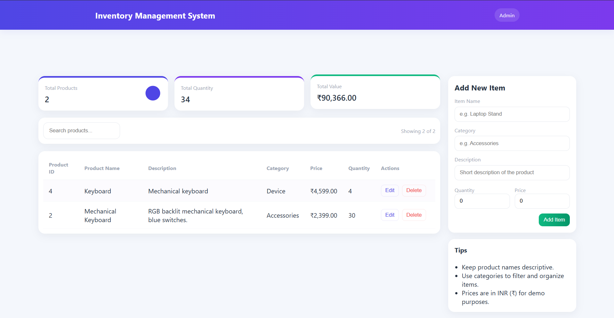

# 📦 Inventory Management System

A modern full-stack **Inventory Management System** built with **React, FastAPI, PostgreSQL, SQLAlchemy, and Supabase**. The application enables users to efficiently manage inventory by adding, updating, deleting, and searching products through a clean, responsive, and intuitive interface.

🌐 **Live Demo:** https://inventory-management-system.lakshyakarn.com.np/


# 📸 Application Preview




---

## ✨ Features

* 📋 View all inventory items
* ➕ Add new inventory items
* ✏️ Edit existing products
* 🗑️ Delete products
* 🔍 Search products by name
* 📊 Dashboard displaying:

  * Total Products
  * Total Quantity
  * Total Inventory Value
* ⚡ Fast REST API powered by FastAPI
* 🗄️ Persistent PostgreSQL database
* 📱 Responsive user interface
* ☁️ Fully deployed cloud application

---

# 🛠️ Tech Stack

## Frontend

* React (Vite)
* JavaScript
* CSS3

## Backend

* FastAPI
* SQLAlchemy
* Pydantic
* Uvicorn

## Database

* PostgreSQL
* Supabase

## Deployment

* Frontend → Vercel
* Backend → Render
* Database → Supabase PostgreSQL

---

# 🚀 Live Application

### Website

https://inventory-management-system.lakshyakarn.com.np/

---

# 🏗️ System Architecture

```text
                    React (Vite)
                         │
                         ▼
                  Frontend (Vercel)
                         │
                   HTTP REST API
                         │
                         ▼
                FastAPI Backend (Render)
                         │
                    SQLAlchemy ORM
                         │
                         ▼
          PostgreSQL Database (Supabase)
```

---

# 📁 Project Structure

```text
inventory-management-system
│
├── backend
│   ├── main.py
│   ├── database.py
│   ├── models.py
│   ├── schemas.py
│   └── requirements.txt
│    
│
├── frontend
│   ├── src
│   ├── package.json
│   ├── vite.config.js
│   └──index.html
│    
│
├── .gitignore
└── README.md
```

---

# ⚙️ Installation

## 1. Clone the Repository

```bash
git clone https://github.com/lakshyakarn10/inventory-management-system.git

cd inventory-management-system
```

---

## 2. Backend Setup

Navigate to the backend directory.

```bash
cd backend
```

Create a virtual environment.

```bash
python -m venv myvenv
```

### Activate Virtual Environment

**Windows**

```bash
myvenv\Scripts\activate
```

**Linux / macOS**

```bash
source myvenv/bin/activate
```

Install the required packages.

```bash
pip install -r requirements.txt
```

Create a `.env` file inside the `backend` directory.

```env
DATABASE_URL=your_supabase_postgresql_connection_string
```

Run the FastAPI server.

```bash
uvicorn main:app --reload
```

The backend will start at:

```
http://127.0.0.1:8000
```

---

## 3. Frontend Setup

Navigate to the frontend directory.

```bash
cd ../frontend
```

Install dependencies.

```bash
npm install
```

Create a `.env` file.

```env
VITE_API_BASE_URL=http://127.0.0.1:8000
```

Run the development server.

```bash
npm run dev
```

Frontend runs at:

```
http://localhost:5173
```

---

# 🔑 Environment Variables

## Backend

```env
DATABASE_URL=your_supabase_postgresql_connection_string
```

## Frontend

For local development:

```env
VITE_API_BASE_URL=http://127.0.0.1:8000
```

For production:

```env
VITE_API_BASE_URL=https://your-render-backend.onrender.com
```

---

# 📡 API Endpoints

| Method | Endpoint      | Description             |
| ------ | ------------- | ----------------------- |
| GET    | `/`           | API Health Check        |
| GET    | `/items`      | Get all inventory items |
| POST   | `/items`      | Create a new item       |
| PUT    | `/items/{id}` | Update an existing item |
| DELETE | `/items/{id}` | Delete an item          |


# 🚀 Deployment

## Frontend

* Hosted on **Vercel**

## Backend

* Hosted on **Render**

## Database

* Hosted on **Supabase PostgreSQL**

---

# 🔮 Future Enhancements

* User Authentication
* Inventory Categories
* Product Images
* Inventory Reports
* Export to CSV/PDF
* Pagination
* Sorting & Filtering
* Low Stock Alerts
* Dark Mode
* Dashboard Analytics

---

# 👨‍💻 Author

**Lakshya Karn**

* GitHub: https://github.com/lakshyakarn10


---


